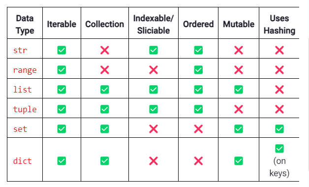

string = input().lower()  
print(f"{total_cost:.02f}") // print value of avriable total_cost two decimal places
if line.lower().endswith("ed")
move = input().strip() This method removes any leading or trailing whitespace characters (like spaces, tabs, newlines) from the input string.

Find the smallest word by length --- small_word = min(words, key=len) -- words=[]
